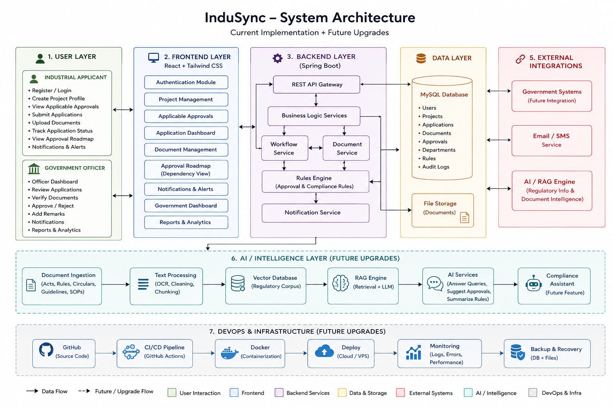
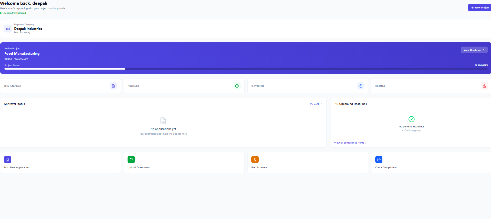
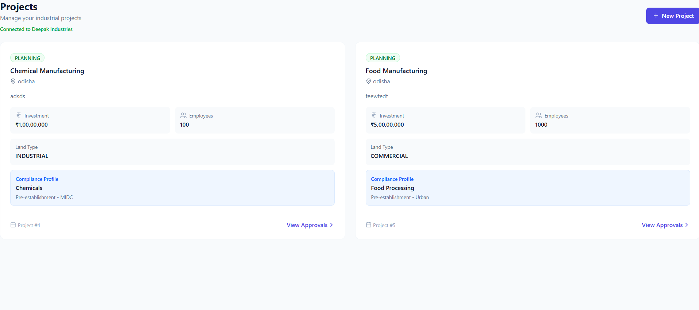
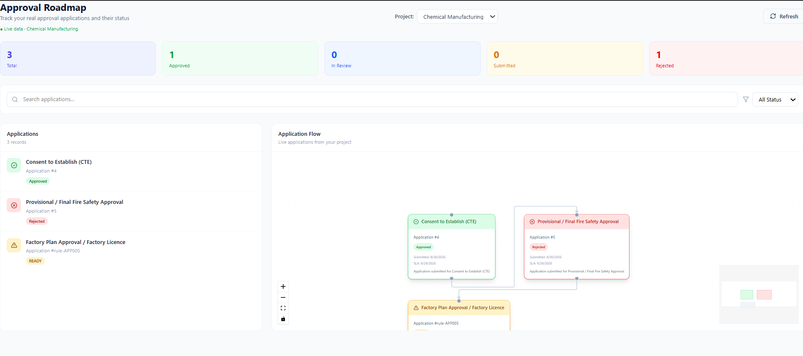
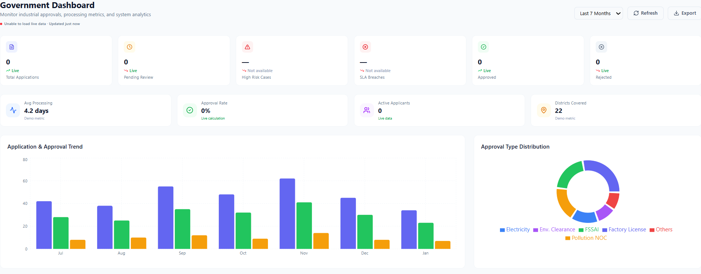

# 🏭 SIH26130 --- Efficiency in Streamlining Industrial Approvals, Compliance Processes, and Access to Government Support Services

### InduSync -- Intelligent Industrial Approval, Compliance & Regulatory Assistance Platform


<p align="center">
  <b>Smart India Hackathon 2026</b><br>
  Streamlining industrial approvals, compliance processes, and access to government support services
</p>

------------------------------------------------------------------------

## 📌 Problem Statement

**SIH26130 --- Efficiency in Streamlining Industrial Approvals,
Compliance Processes, and Access to Government Support Services**

Industrial projects often require multiple approvals from different
departments. Applicants must identify applicable approvals, understand
dependencies, prepare documents, submit applications, and track their
status. Missing even one requirement can lead to delays and repeated communication.

InduSync addresses this fragmentation through a centralized,
project-aware platform connecting the industrial applicant workflow with
the government approval workflow.

------------------------------------------------------------------------

# 📍 Executive Summary

InduSync is a full-stack industrial compliance and approval management
platform designed around the lifecycle of an industrial project.

The platform uses the project's **industry, project stage, location
type, hazardous-waste status, fire-safety requirements, and production
status** to determine applicable approvals through a deterministic Rules
Engine.

### Core workflow

``` text
Company Registration
        ↓
Create Industrial Project
        ↓
Project Compliance Profile
        ↓
Rules Engine Evaluation
        ↓
Applicable Approvals Identified
        ↓
Approval Roadmap Generated
        ↓
Applicant Submits Application
        ↓
Government Dashboard
        ↓
Review / Approve / Reject
        ↓
Applicant Roadmap Updated
```

### Core capabilities

-   🏭 Project and company management
-   ⚙️ Rule-based approval identification
-   🗺️ Approval dependency roadmap
-   📄 Application submission and tracking
-   🏛️ Government-side application processing
-   ⏱️ Approval status and SLA tracking
-   📊 Dashboard analytics
-   🔐 JWT authentication and role-based access
-   🤖 Architecture for future AI/RAG regulatory assistance

------------------------------------------------------------------------

# 🎯 Existing Challenges

1.  **Manual approval identification** --- Applicants may not know which
    permissions apply to their project.
2.  **Fragmented approval process** --- Different approvals involve
    different departments and requirements.
3.  **Poor dependency visibility** --- Applicants may not understand
    which approvals precede others.
4.  **Application tracking difficulty** --- Status, documents and
    deadlines can be difficult to manage.
5.  **Limited applicant-government synchronization** --- Submitted
    applications need a clear workflow with the concerned authority.
6.  **Lack of project-specific compliance intelligence** --- Generic
    information is less useful than requirements derived from the actual
    project.

------------------------------------------------------------------------

# 💡 Proposed Solution

InduSync creates a project-specific compliance profile and uses it as
the basis for regulatory decision-making.

Example:

``` text
Industry              → Chemicals
Project Stage         → Pre-establishment
Location Type         → MIDC
Hazardous Waste       → Yes
Fire Safety Required  → Yes
Production Started    → No
```

The Rules Engine evaluates these parameters and identifies applicable
approvals.

``` text
Chemical Manufacturing
        │
        ├── Consent to Establish (CTE)
        ├── Provisional / Final Fire Safety Approval
        └── Factory Plan Approval / Factory Licence
```

The applicant can then submit applications against the relevant approval
requirements.

------------------------------------------------------------------------

# 🧠 Regulatory Rules Engine

The current prototype uses a **deterministic rule-based engine**, not an
AI model, for core approval determination.

Rules are maintained in structured configuration and evaluated by the
Spring Boot backend.

Example:

``` json
{
  "rule_id": "RULE001",
  "industry": "Chemicals",
  "project_stage": "Pre-establishment",
  "approval_id": "APP001"
}
```

Conditional example:

``` json
{
  "rule_id": "RULE002",
  "requires_fire_safety": true,
  "approval_id": "APP004"
}
```

### Advantages

-   Deterministic results
-   Explainable decisions
-   Easy rule modification
-   Fast evaluation
-   No AI dependency for core approval logic

------------------------------------------------------------------------

## 🏛️ System Architecture

The following architecture represents the current InduSync implementation along with planned future upgrades.



> **Implementation note:** The current prototype's core workflow is
> powered by the Rules Engine and relational database. AI/RAG is a
> proposed intelligence extension and is not presented as a fully
> implemented production feature.

------------------------------------------------------------------------

# 🛠️ Complete Technology Stack

  -----------------------------------------------------------------------
  Layer                   Technologies            Purpose
  ----------------------- ----------------------- -----------------------
  Frontend                React, Vite             Interactive web
                                                  application

  UI                      Tailwind CSS            Responsive enterprise
                                                  interface

  API Communication       Axios                   REST communication

  Approval Visualization  React Flow              Approval dependency
                                                  roadmap

  Analytics               Recharts                Dashboard analytics

  Backend                 Java, Spring Boot       REST APIs and business
                                                  logic

  Persistence             Spring Data JPA         Database access

  ORM                     Hibernate               Object-relational
                                                  mapping

  Database                MySQL                   Persistent application
                                                  data

  Security                Spring Security, JWT    Authentication and
                                                  role-based access

  Regulatory Logic        Java Rules Engine +     Project-specific
                          JSON                    approval identification

  Architecture            REST                    Frontend/backend
                                                  integration

  Development             Git, GitHub, VS Code /  Development and
                          IntelliJ                collaboration
  -----------------------------------------------------------------------

------------------------------------------------------------------------

# 🔐 Security Architecture

``` text
User Login
    ↓
Backend Authentication
    ↓
JWT Token
    ↓
Authenticated API Requests
    ↓
Role-based Authorization
```

### Roles

``` text
                 ┌── Applicant
User ── Login ───┤
                 └── Government
```

The role determines which workflow and protected APIs the user can
access.

Security objectives include authentication, JWT authorization,
role-based access and separation of applicant/government operations.

------------------------------------------------------------------------

# 👤 Applicant Workflow

``` text
1. Login / Register
        ↓
2. Company Profile
        ↓
3. Create Project
        ↓
4. Enter Compliance Profile
        ↓
5. Rules Engine Evaluation
        ↓
6. View Applicable Approvals
        ↓
7. Open Approval Roadmap
        ↓
8. Submit Application
        ↓
9. Track Application
        ↓
10. Receive Approval / Rejection
```

The applicant dashboard provides active project information, project
status, approval statistics, approval status, deadlines and the
project-specific approval journey.

------------------------------------------------------------------------

# 🏭 Project Management

Each project stores general project information together with
compliance-specific attributes.

### Project information

-   Project name
-   Description
-   Location
-   Investment amount
-   Number of employees
-   Land type
-   Project status

### Compliance profile

-   Industry
-   Project stage
-   Location type
-   Generates hazardous waste
-   Requires fire safety
-   Production started

This profile becomes the input to the Rules Engine.

------------------------------------------------------------------------

# 🗺️ Approval Roadmap

The Approval Roadmap provides a visual representation of approvals
applicable to the selected project.

Example:

``` text
        ┌──────────────────────────┐
        │ Consent to Establish     │
        │ CTE                      │
        └────────────┬─────────────┘
                     │
                     ▼
        ┌──────────────────────────┐
        │ Fire Safety Approval     │
        └────────────┬─────────────┘
                     │
                     ▼
        ┌──────────────────────────┐
        │ Factory Plan / Licence   │
        └──────────────────────────┘
```

The roadmap supports:

-   Project selection
-   Applicable approval identification
-   Approval status
-   Application details
-   Submission information
-   SLA deadline
-   Remarks
-   Dependency visualization

The roadmap is generated from the selected project's data rather than
being a static page.

------------------------------------------------------------------------

# 📄 Application Management

Applicants can create and submit applications for required approvals.

Applications contain information such as:

-   Approval type
-   Project
-   Applicant
-   Application status
-   Submission date
-   SLA deadline
-   Remarks
-   Required documents

### Application lifecycle

``` text
READY
  ↓
SUBMITTED
  ↓
IN_REVIEW
  ↓
APPROVED
```

Alternative:

``` text
IN_REVIEW
    ↓
REJECTED
```

------------------------------------------------------------------------

# 🏛️ Government Dashboard

The government dashboard provides authorities with a centralized view of
incoming applications.

``` text
Application Submitted
        ↓
Government Dashboard
        ↓
Application Review
        ↓
Check Details / Documents
        ↓
Approve / Reject
        ↓
Database Update
        ↓
Applicant Roadmap Updated
```

This connects application submission with government-side processing
rather than treating the two dashboards as independent mock interfaces.

------------------------------------------------------------------------

# 🔄 End-to-End Data Flow

``` text
                    PROJECT CREATION
                          │
                          ▼
              ┌─────────────────────┐
              │ Compliance Profile  │
              └──────────┬──────────┘
                         │
                         ▼
                ┌─────────────────┐
                │   Rules Engine  │
                └────────┬────────┘
                         │
                         ▼
              Applicable Approvals
                         │
                         ▼
                Approval Roadmap
                         │
                         ▼
                 Create Application
                         │
                         ▼
                Government Dashboard
                         │
                  ┌──────┴──────┐
                  ▼             ▼
               APPROVE        REJECT
                  │             │
                  └──────┬──────┘
                         ▼
                 Database Update
                         │
                         ▼
                Applicant Roadmap
```

------------------------------------------------------------------------

# 🗄️ Backend Data Model

``` text
User
 │
 ├── Role
 │
 └── Authentication

Company
 │
 └── Projects
       │
       ├── Compliance Profile
       │
       └── Applications
              │
              └── Approval
```

### Major entities

-   User
-   Company
-   Project
-   Approval
-   Application
-   Regulatory / compliance records

Relationships are managed through JPA/Hibernate and persisted in MySQL.

------------------------------------------------------------------------

# ⚙️ Backend API Architecture

``` text
React
  │
  ├── Authentication APIs
  ├── Project APIs
  ├── Dashboard APIs
  ├── Application APIs
  └── Rules Engine API
          │
          ▼
     Spring Boot
```

### Rules Engine

``` text
POST /api/rules/evaluate
```

Example request:

``` json
{
  "industry": "Chemicals",
  "projectStage": "Pre-establishment",
  "locationType": "MIDC",
  "generatesHazardousWaste": true,
  "requiresFireSafety": true,
  "hasStartedProduction": false
}
```

For the above profile, the prototype's rules can identify:

``` text
APP001 → Consent to Establish (CTE)
APP004 → Provisional / Final Fire Safety Approval
APP005 → Factory Plan Approval / Factory Licence
```

------------------------------------------------------------------------

# 🤖 AI / RAG --- Proposed Intelligence Layer

The long-term architecture includes an AI/RAG layer for regulatory
intelligence.

### Proposed capabilities

-   Regulatory Assistant
-   Compliance Assistant
-   Government scheme information retrieval
-   Regulatory document processing
-   Information extraction
-   Document mismatch detection
-   Source-backed regulatory explanations

### Proposed architecture

``` text
Government Circulars
Acts / Rules
Regulatory Documents
       │
       ▼
Document Processing
       │
       ▼
Knowledge Base / Vector Store
       │
       ▼
Retriever
       │
       ▼
LLM
       │
       ▼
Source-backed Answer
```

RAG is proposed because regulatory information can change over time.
Retrieval can ground responses in relevant regulatory documents.

**Current status:** AI/RAG is not required for the current core
approval-generation workflow. The deterministic Rules Engine is the
implemented foundation.

------------------------------------------------------------------------

# 📊 Existing Approach vs InduSync

  -----------------------------------------------------------------------
  Existing Approach                   InduSync
  ----------------------------------- -----------------------------------
  Manual approval discovery           Project-specific rule evaluation

  Scattered information               Centralized platform

  Generic regulatory information      Compliance-profile-driven
                                      requirements

  Limited dependency visibility       Visual approval roadmap

  Separate application tracking       Integrated application lifecycle

  Limited applicant-government        Applicant + Government dashboards
  interaction                         

  Static status tracking              Database-backed status updates

  Difficult project-level visibility  Project-specific compliance journey

  AI as core decision maker           Deterministic Rules Engine for core
                                      decisions

  Future intelligence added           AI/RAG designed as an extensible
  separately                          layer
  -----------------------------------------------------------------------

------------------------------------------------------------------------

# 🧪 Demonstration Scenario

### Chemical Manufacturing Project

``` text
Industry:
Chemicals

Project Stage:
Pre-establishment

Location Type:
MIDC

Generates Hazardous Waste:
Yes

Requires Fire Safety:
Yes

Production Started:
No
```

The Rules Engine identifies:

``` text
1. Consent to Establish (CTE)
2. Provisional / Final Fire Safety Approval
3. Factory Plan Approval / Factory Licence
```

The applicant can create an application, such as a
pollution/consent-related application.

The application is then visible in the Government Dashboard.

After government processing:

``` text
Government Action
       ↓
APPROVED / REJECTED
       ↓
Database
       ↓
Applicant Roadmap
       ↓
Updated Application Status
```

This demonstrates the complete workflow from **project creation →
regulatory identification → application → government processing →
applicant status update**.

------------------------------------------------------------------------

# 🖥️ Screenshots

Create a `docs/screenshots/` folder and add the actual screenshots.

### Applicant Dashboard

``` text

```

### Projects

``` text

```

### Approval Roadmap

``` text

```

### Government Dashboard

``` text

```

### Application Submission

``` text

```

------------------------------------------------------------------------

# 📁 Project Structure

``` text
SIH-2026/
│
├── frontend/
│   ├── src/
│   │   ├── components/
│   │   ├── pages/
│   │   ├── services/
│   │   ├── context/
│   │   └── ...
│   ├── package.json
│   └── ...
│
├── backend/
│   ├── src/
│   │   └── main/
│   │       ├── java/
│   │       │   └── com/codexminds/indusync/
│   │       │       ├── controller/
│   │       │       ├── service/
│   │       │       ├── entity/
│   │       │       ├── dto/
│   │       │       └── ...
│   │       │
│   │       └── resources/
│   │           └── rules-engine/
│   │               └── rules.json
│   │
│   └── pom.xml
│
├── docs/
│   └── screenshots/
│
├── README.md
└── .gitignore
```

------------------------------------------------------------------------

# 🚀 Quickstart Guide

## 1. Clone the Repository

``` bash
git clone <YOUR_REPOSITORY_URL>
cd SIH-2026
```

## 2. Configure MySQL

Create the required database and configure the backend database
connection.

Example:

``` properties
spring.datasource.url=jdbc:mysql://localhost:3306/<database_name>
spring.datasource.username=<username>
spring.datasource.password=<password>
```

Do not commit credentials to GitHub.

## 3. Start the Backend

From PowerShell:

``` powershell
cd backend
.\mvnw.cmd spring-boot:run
```

## 4. Start the Frontend

Open another terminal:

``` powershell
cd frontend
npm install
npm run dev
```

Open the Vite development URL shown in the terminal.

------------------------------------------------------------------------

# 🔧 Environment & Security Configuration

Never commit:

-   Database passwords
-   JWT secrets
-   API keys
-   `.env` files containing credentials
-   Production secrets

Use environment/configuration files and include sensitive files in
`.gitignore`.

------------------------------------------------------------------------

# 🧭 Development Roadmap

  Phase   Module                                 Status
  ------- -------------------------------------- --------------
  1       Frontend foundation                    ✅ Completed
  2       Spring Boot backend                    ✅ Completed
  3       MySQL + JPA persistence                ✅ Completed
  4       Authentication + role-based workflow   ✅ Completed
  5       Project management                     ✅ Completed
  6       Rules Engine                           ✅ Completed
  7       Approval Roadmap                       ✅ Completed
  8       Application workflow                   ✅ Completed
  9       Government Dashboard                   ✅ Completed
  10      Dashboard analytics                    ✅ Completed
  11      AI/RAG regulatory intelligence         🔄 Proposed
  12      Production deployment                  🔄 Future

------------------------------------------------------------------------

# 🔬 Prototype Validation

The prototype has been validated through an end-to-end demonstration:

``` text
Create Project
      ↓
Rules Engine
      ↓
Applicable Approvals
      ↓
Create Application
      ↓
Government Dashboard
      ↓
Approve / Reject
      ↓
Applicant Roadmap
```

The Rules Engine has also been tested directly through the backend API
using project-specific compliance parameters.

------------------------------------------------------------------------

# 🌟 Key Differentiators

### 1. Project-Aware Compliance

Requirements are generated from the actual project's compliance profile.

### 2. Deterministic Regulatory Logic

The core approval engine uses explicit rules, making decisions
explainable and predictable.

### 3. Visual Approval Roadmap

Applicants can understand their approval journey instead of viewing
approvals as an unstructured list.

### 4. Applicant--Government Workflow

The prototype connects application submission with government-side
processing.

### 5. Database-Backed State

Project and application states are persisted instead of relying only on
frontend mock data.

### 6. Extensible Intelligence Layer

AI/RAG can be added without replacing the deterministic compliance
foundation.

------------------------------------------------------------------------

# 👥 Team CodeXMinds

  Member     Responsibility
  ---------- ------------------------------------------
  Member 1   Project Lead / Full-Stack Integration
  Member 2   Frontend Development
  Member 3   Backend Development
  Member 4   Rules Engine / Compliance Logic
  Member 5   Government Workflow / Application Module
  Member 6   UI, Testing & Integration

> Replace these with your actual member names and responsibilities
> before publishing.

------------------------------------------------------------------------

# 📜 Smart India Hackathon 2026

**Problem Statement:** SIH26130\
**Project:** InduSync\
**Team:** CodeXMinds\
**Category:** Software

------------------------------------------------------------------------

# 📄 License

This project has been developed as a Smart India Hackathon 2026
prototype by Team CodeXMinds.

------------------------------------------------------------------------

```{=html}
<p align="center">
```
`<b>`{=html}InduSync --- Making Industrial Compliance Simpler, Traceable
and Project-Aware.`</b>`{=html}
```{=html}
</p>
```
